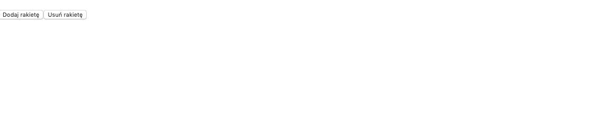
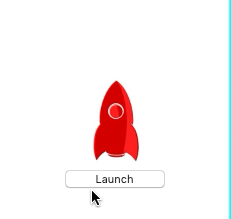

# Egzamin

## Wytyczne

1. Stwórz [*fork*](https://guides.github.com/activities/forking/) repozytorium z zadaniami.
2. Sklonuj repozytorium na swój komputer. Użyj do tego komendy `git clone adres_repozytorium`
Adres repozytorium możesz znaleźć na stronie repozytorium po naciśnięciu w guzik "Clone or download".
3. Rozwiąż zadania i skomituj zmiany do swojego repozytorium. Aby dodać pojedynczy plik użyj komendy `git add nazwa_pliku`.
Jeżeli chcesz dodać wszystkie zmienione pliki, użyj `git add .`
Pamiętaj, że kropka na końcu jest ważna!
Następnie skommituj zmiany komendą `git commit -m "nazwa_commita"`
4. Wypchnij zmiany do swojego repozytorium na GitHubie. Użyj do tego komendy `git push origin master`
5. Stwórz [*pull request*](https://help.github.com/articles/creating-a-pull-request) do oryginalnego repozytorium, gdy skończysz wszystkie zadania.

## Uwagi dotyczące rozwiązywania zadań

Zadania są testowane za pomocą **testów automatycznych**. Zwróć zatem uwagę na następujące rzeczy:

* Jeśli w treści zadania jest wspomniane aby konkretny tekst został wpisany/zwrócony/wyśwetlony, to powinien być to **dokładnie taki sam** tekst jak w treści zadania.

* Pamiętaj również o tym aby nazwy funkcji/komponentów były **dokładnie takie same** jak w treści zadania.

* Zadania rozwiązuj w odpowiednich plikach **js**.

* Zawsze sprawdzaj czy Twoje rozwiązanie działa. Jeśli powoduje ono błędy w konsoli, nie zostanie ocenione. W takim przypadku lepiej **zakomentuj wrażliwe części**.


## Przygotowanie

> W głównym katalogu repozytorium uruchom komendę `npm install` aby zainstalować wszystkie niezbędne zależności. Wszystkie zależności potrzebne do wykonania egzaminu są wprowadzone do pliku `package.json` dlatego wytarczy uruchomić komendę `npm install`.
> 
> Plik `webpack.config.js` też został już przygotowany do specyfiki tego egzaminu. Nie ma potrzeby jego edytowania.
>
> Aby uruchomić projekt, należy po instalacji, wpisać w terminalu `npm start`. Projekt uruchomi serwer deweloperski. 
>
> **UWAGA!** Jeżeli podczas uruchomienia komendy `npm start` pojawi się komunikat: `Error: listen EADDRINUSE: address already in use`, należy zmienić wartość klucza `port` w pliku `webpack.config.js`, np. na `3002` i uruchomić serwer ponownie (`npm start`). Wtedy będzie osiągalny pod adresem: `http://localhost:3002`.

---

# Zadanie 1 - Routing
W pliku `components/App.js` zaimplementuj prosty routing. Powinien składać się z trzech ścieżek

- `/` - strona główna
- `/platform` - aplikacja docelowa
- `/about` - o aplikacji

Strona główna powinna wyświetlić komponent `Main`, który renderuje powitanie:

```js
<h1>Witaj w aplikacji rocket launch!</h1>
```

`/platform` powinien wyrenderować platformę do startowania rakiety. Na potrzeby tego wyrenderuj kontener `Platform`.


`/about` renderuje info o aplikacji. Utwórz osobny komponent `About`:

```js
<p>Aplikacja rocket launch w ramach egzaminu</p>
```

Na górze aplikacji zaimplementuj menu nawigacyjne (linki do 3 podstron):

- Strona główna
- Platforma
- O Aplikacji

Aktywny link powinien mieć:

- czerwony kolor czcionki (`red`)
- pogrubienie (`bold`)

W razie błędnej ścieżki np. `/to/nie/jest/poprawna/ścieżka` wyrenderuj komponent `NotFound` z katalogu `components`.

Komponent `NotFound` powinien renderować: `<h1>404 - nie znaleziono strony</h1>`.

---

# Zadanie 2 - Dodawanie i usuwanie rakiety
Aplikacja rocket launch ma służyć do symulacji odpalania rakiet z platformy startowej. 
W tym zadaniu należy przygotować warstwę stanu aplikacji `store` dla dodawania i usuwania rakiet z platformy.

W pliku `redux/actions` zaimplementuj 2 typy akcji:

- ADD_ROCKET
- REMOVE_ROCKET

W pliku `redux/reducer` zaimplementuj reducer obsługujący naszą aplikację. Jego główną funkcją będzie przechowywanie informacji o rakietach.
Stan początkowy ustaw na pustą tablicę: `[]`.

Rakieta opisywana jest za pomocą obiektu:

```json
{
  isLaunched: false,
  counter: 5
}
```

Zaimplementuj reducer tak aby reagował na akcje `ADD_ROCKET` (dodanie nowej rakiety), `REMOVE_ROCKET` (usunięcie rakiety).

Akcja usuwania ma usuwać ostatnio dodaną rakietę (tę z końca listy).

---

# Zadanie 3 - connect Platform
Zaimplementuj stworzony w zadaniu 1 komponent `Platform`. Ma on realizować następujące funckje:

- wyświetlanie przycisku `<button>Dodaj rakietę</button>`
- wyświetlanie przycisku `<button>Usuń rakietę</button>`
- wyświetlanie listy rakiet na podstawie stanu (komponent rakiety jest już gotowy w pliku `components/Rocket`)

Połącz Platformę ze storem. Przekaż odpowiednie metody do dodawania i usuwania rakiety.



---

# Zadanie 4 - odpalanie rakiet
Każda z rakiet ma przycisk `Launch`. Zaimplementuj akcję odpalania rakiety. Po kliknięciu przycisku `Launch` zacznij odliczanie.
Po rozpoczęciu odliczania guzik ma wyświetlać stan licznika od 4 do 0 (liczymy co sekundę). 
Kiedy licznik dojdzie do zera ustaw flagę `launch` dla danej rakiety na true. Spowoduje to odpalenie rakiety.




